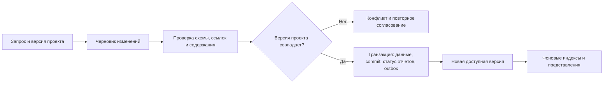

# Knit: устройство исследовательского пространства

Статус: проект архитектуры для обсуждения, без утверждения о реализованных гарантиях. Связанный документ: [продуктовая модель и предложения для КТ-1](kt1-revision-proposal.md).

## 1. Назначение

Knit хранит источники, утверждения, связи между ними и результаты анализа в одной канонической модели. Человек работает с отчётами и страницами сущностей; агент получает те же данные через MCP. Разные представления не образуют независимых копий знания.

Постоянная память должна помогать пяти задачам: **C — Citation**, **M — Modification**, **I — Inference**, **R — Retrieval**, **A — Accessibility**. Устройство данных и операции записи обеспечивают проверяемость и сохранность; корректность анализа и удобство отчёта требуют самостоятельной оценки.

На первом этапе достаточно транзакционной базы, хранилища исходных файлов, фонового исполнителя и общего веб-интерфейса. Несколько видов графов можно представить таблицами связей; пять отдельных графовых СУБД не требуются.

## 2. Канонические сущности

| Сущность | Смысл и основные данные |
| --- | --- |
| `Project` | Иерархия проектов и подпроектов, например «Нейробиология → Сознание»; принадлежность рабочему пространству и правила доступа |
| `Entity` | Устойчивая идентичность предмета исследования: понятие, метод, организация и т. п.; название, псевдонимы, тип. Страница сущности собирает связанные утверждения и материалы |
| `SourceRef` | Ссылка на работу или внешний ресурс с библиографическими данными; сама по себе не означает, что содержимое сохранено |
| `SourceCapture` | Неизменяемый снимок конкретной версии источника; ссылка на файл/объект, hash, время получения, адрес оригинала, тип содержимого |
| `SourceFragment` | Фрагмент конкретного снимка: текст, страница PDF и координаты, строка таблицы или временной интервал; версия способа извлечения |
| `Claim` | Утверждение с областью применимости, временем действия, модальностью и статусом; версии текста и связей |
| `EvidenceLink` | Связь версии утверждения с фрагментом: поддерживает, опровергает или уточняет; обоснование связи и сведения о проверке |
| `Artifact` | Отчёт, сравнение, обзор, таймлайн или другой результат анализа; версия, цель, использованные версии утверждений и спецификация ответа |
| `View` | Настройки представления сущности или артефакта; layout, плотность, порядок блоков и ссылки на канонические данные |
| `Commit` | Атомарно принятый набор типизированных изменений, автор, время, предыдущее состояние, основание и идентификатор операции |
| `Episode` | Ограниченный контекст рабочей сессии: вопрос, цель, ход обсуждения, ссылки на полученные результаты |
| `Decision` | Зафиксированное решение с основаниями и статусом; может ссылаться на Episode, доказательства и Commit |
| `PreferencesSpec` | Версионируемые предпочтения пользователя или проекта о работе с данными и представлении результатов |
| `ReportSpec` | Спецификация конкретного отчёта: цель, аудитория, вопросы, рекомендуемая структура, требуемые основания и критерии готовности |

Один `SourceRef` может иметь несколько снимков. Извлечённый текст — производный материал: исправление OCR создаёт новую версию извлечения и не изменяет оригинальный PDF. Ссылка «страница 12» должна относиться к конкретному снимку, иначе после обновления источника она может указывать на другое место.

`Entity` нужна для устойчивых страниц wiki; совпадение названия само по себе не повод объединять сущности. Иерархия проектов организует работу пользователя, а тематическая классификация описывает предметную область. Артефакт может ссылаться на данные из нескольких разрешённых проектов без копирования источников.

### Проверки как свойства

В интерфейсе проверки можно показывать свойством объекта: «источник доступен», «цитата проверена», «поддержка тезиса спорна». Вместо отдельного пользовательского типа Attestation предлагается свойство `checks`, содержащее записи проверок:

```json
{
  "target_revision": "claim-17@4",
  "property": "evidence_support",
  "result": "needs_review",
  "evidence_revision": "fragment-8@1",
  "checked_by": "reviewer-or-model-run-id",
  "checked_at": "timestamp",
  "method_version": "support-rubric-v1",
  "reason": "Фрагмент относится к другой исследованной группе"
}
```

На уровне хранения такие записи могут быть отдельной таблицей. Одного числа `confidence` недостаточно: оно не объясняет, что проверялось, кем и для какой версии. После изменения тезиса прежняя проверка остаётся в истории, но не подтверждает новую версию. Если используется confidence, нужны его источник и интерпретация; самооценка модели не является калиброванной вероятностью истинности. Подписанные внешние attestations можно добавить позднее.

### Независимые свойства состояния

| Свойство | Назначение |
| --- | --- |
| `lifecycle` | `draft`, `committed`, `rejected`, `archived`; черновик не попадает в принятое знание без явного запроса |
| `freshness` | `current`, `stale`, `unknown`; отражает изменение оснований отчёта, а не его истинность |
| `access` | Кто имеет право читать, менять или публиковать; приватность и доступ по ролям |
| `publication` | Наличие явно опубликованной версии; приватная работа не становится публичной от обычного сохранения |
| `context_policy` | Что поднимать в начале работы и что извлекать по запросу: `on_start`, `on_demand`, `manual_only` |

Слово visibility нельзя одновременно использовать для приватности и приоритета контекста. Скрытый из стартового контекста материал может оставаться доступным по запросу; материал без разрешения на чтение недоступен агенту вообще. `on_start` задаёт приоритет в ограниченном бюджете контекста, а не обещание загрузить любое количество данных.

Для неизменяемых версий признаки вроде актуальности вычисляются по отношению к выбранному состоянию проекта. Новые события не переписывают старое содержание.

### Соответствие прежним названиям

| Прежнее обозначение | Новая трактовка |
| --- | --- |
| `Sources` | `SourceRef` и `SourceCapture` |
| `Evidence` | `SourceFragment`; связь с утверждением хранится отдельно |
| `ClaimEvidence` | `EvidenceLink` |
| `Reports` | `Artifact` с типом отчёта |
| `PageView` | `View` |
| `Memory` | `PreferencesSpec` для предпочтений; факты относятся к Claim, решения — к Decision |
| `Updates` | Commit фиксирует изменение; Decision объясняет решение; Episode сохраняет контекст обсуждения |
| `Attestation` | История проверок в свойстве `checks`; позднее возможен самостоятельный формат подписанного свидетельства |

Commit, Episode и Decision не взаимозаменяемы: одна беседа может породить несколько изменений, а одно решение — реализовываться несколькими commit.

## 3. Графы как представления данных

| Граф | Структура | Для чего нужен |
| --- | --- | --- |
| Тематическая классификация | DAG для отношений «шире → уже» | Навигация и выбор направлений изучения; произвольные тематические ассоциации не обязаны быть ацикличными |
| Доказательства | Типизированный multigraph, циклы допустимы | Утверждения, их основания, уточнения и противоречия |
| Происхождение | Ориентированные связи между версиями данных и запусками | Восстановление того, из каких входов получен результат; временная зависимость новых версий от старых ациклична |
| История изменений | DAG commit; в MVP достаточно линейной истории | Версии, затем форки и слияния |
| Проверки | Связи записей `checks` с конкретными версиями | Кто и какое свойство проверил; отдельное графовое хранилище не требуется |

В MVP эти связи индексируются для поиска зависимых отчётов, перехода от тезиса к источнику и поиска противоречий. Полноценные графовые визуализации добавляются там, где помогают пользователю найти ответ.

## 4. Контракт операций

### Инварианты

1. Каждый сохранённый фрагмент относится к существующему снимку. Каждая EvidenceLink указывает на существующие версии и допустимый тип связи.
2. Фактическое утверждение, принятое как подтверждённое, имеет основания и запись содержательной проверки. Непроверенное утверждение может храниться с явным статусом; существование ссылки не повышает его до подтверждённого.
3. Отчёт указывает, на какой версии исследования и каких версиях оснований он построен. Чтение не смешивает несовместимые версии.
4. Изменения, событие Commit и обновление состояния зависимых отчётов становятся видимыми совместно. Частичный результат подготовки остаётся черновиком.
5. Повтор одного ключа операции с тем же содержимым возвращает прежний результат. Тот же ключ с другим содержимым отклоняется.
6. Устаревшее основание записи вызывает конфликт; чужие изменения не затираются молча.
7. Проверки доступа действуют на поиск, исходные фрагменты, записи, экспорт и производные представления.

Атомарность относится к фиксации подготовленного набора изменений. LLM, загрузка источников и внешние платёжные операции находятся за пределами транзакции базы. [Транзакции PostgreSQL](https://www.postgresql.org/docs/current/tutorial-transactions.html) дают основу для совместной фиксации изменений внутри базы; они сами по себе не делают атомарными внешние вызовы.

### Путь обновления



1. `stage` создаёт черновик с `base_revision` и отдельным статусом выполнения. Получение источников, анализ и генерация выполняются вне транзакции.
2. Сохраняются неизменяемые файлы, проверяются hash и доступность. Непривязанные к commit объекты допускают последующую сборку мусора, но ещё не становятся принятым знанием.
3. Валидатор проверяет ссылки, версии, допустимые операции и права. Содержательные проверки оценивают поддержку тезисов; спорный вывод не превращается в факт только потому, что прошёл JSON Schema.
4. Короткая транзакция блокирует строку состояния проекта и сверяет её с `base_revision`. Затем фиксирует версии изменённых объектов, связи, Commit, результат идемпотентной операции и задания фонового обновления. Смена текущей версии происходит в той же транзакции.
5. После commit выполняются фоновые задания из outbox — таблицы задач, записанной вместе с данными. Повторный запуск обработчика безопасен. Индекс или уведомление могут запаздывать, но факт фиксации не теряется.

Для первого прототипа предлагается последовательная фиксация изменений в одном проекте. Долгие исследования могут идти параллельно; перед записью их результат сверяется с актуальной версией. Автоматическое семантическое слияние не требуется для MVP. Атомарная запись сразу в несколько проектов остаётся вне первого контракта.

### Что происходит с отчётом при изменении тезиса

Возможны два явно различимых результата:

| Режим | Что фиксируется совместно |
| --- | --- |
| Готовое обновление исследования | Новые утверждения, связи, новая версия отчёта и Commit |
| Обновление данных с последующей генерацией отчёта | Новые утверждения, связи, Commit и отметка об устаревании зависимых отчётов; задача их пересчёта |

Во втором режиме прежний отчёт остаётся доступен как отчёт по предыдущему состоянию. Интерфейс не называет его обновлённым и показывает, какие основания изменились. Если операция обещала пользователю готовый обновлённый отчёт, второй режим не считается полным успехом этой операции.

Зависимости фиксируются при создании артефакта. Изменение должно помечать затронутые отчёты, включая известные косвенные зависимости. Если полнота зависимостей ещё не обеспечена, безопасный вариант MVP — пометить все отчёты проекта как требующие проверки; это ограничение точности, а не скрытая гарантия.

### Чтение и восстановление

`fetch` читает заданную версию. Серия связанных чтений использует один snapshot ID — идентификатор зафиксированного состояния. Поисковый ответ сообщает версию индекса; если он отстаёт, система использует актуальное хранилище или явно сообщает ограничение. Новый commit нельзя объявлять полностью доступным через поиск, пока индекс его не содержит.

После сбоя до commit принятое состояние остаётся прежним. После commit, но до ответа клиенту, повтор с тем же ключом получает уже сохранённый результат. Отказ после внешнего списания требует сверки расходов, а не повторного слепого вызова. Отмена до commit оставляет черновик; отмена после commit не удаляет принятую историю. Исправление выполняется следующим commit.

### Минимальная матрица технических проверок

| Сбой или пограничный случай | Ожидаемый результат |
| --- | --- |
| Evidence ID отсутствует; hash не совпадает | Изменение не принимается; прежнее состояние сохраняется |
| ID существует, но текст не поддерживает тезис | Структурная проверка проходит, содержательная отклоняет подтверждённый статус или требует рассмотрения |
| Процесс остановлен после подготовки тезиса, до отчёта | Черновик неполон; в текущем состоянии нет частично принятого исследования |
| Ошибка внутри транзакции до записи Commit | Ни одна её часть не видна как принятая |
| Commit выполнен, HTTP-ответ потерян | Повтор возвращает тот же commit без дублирования |
| Два автора пишут от одной исходной версии | Один commit принят; второму возвращён конфликт |
| Ключ операции повторён с другим набором изменений | Явная ошибка, без изменения состояния |
| Источник исправлен, отчёт ещё не пересоздан | Старый отчёт помечен устаревшим и закреплён за прежними основаниями |
| Индекс не обновился | Явный статус версии/запаздывания или чтение из актуального хранилища |
| В публичный экспорт попал приватный фрагмент | Экспорт блокируется или выпускается явная отредактированная версия без закрытых данных |

Тесты должны проверять сохранённое состояние после перезапуска, а не только текст ответа инструмента. Их прохождение на конечной выборке подтверждает проверенные сценарии; оно не заменяет анализ всех путей записи.

### Денежный контракт задания

Инференс оплачивает пользователь. Предлагаемый лимит по умолчанию — **$2 на всё задание**, включая повторы, проверки, подагентов и платные инструменты. Пользователь может изменить его в настройках; агент и подагенты этого права не имеют. Новое задание получает лимит из настроек без дополнительного подтверждения запуска. Для уже запущенного задания сохраняется прежний лимит, пока пользователь явно не изменит его для этого задания. Фактическое списание может быть меньше лимита. Все дочерние операции используют один корневой идентификатор задания и общий журнал расходов.

Перед платным вызовом шлюз атомарно проверяет и резервирует верхнюю границу его стоимости:

```text
spent + reserved_in_flight + max_cost(next_call) <= approved_budget
```

`spent` — уже подтверждённые расходы, `reserved_in_flight` — резервы выполняющихся вызовов и вызовов с ещё неизвестным исходом. Проверка выполняется вместе с изменением резерва в транзакции, чтобы параллельные исполнители не потратили один остаток несколько раз. Доступный баланс пользователя также учитывает резервы других заданий.

Верхняя граница вызова учитывает размер входа, оплачиваемый выход и reasoning, разрешённый тариф маршрута и дополнительные сборы инструмента. Шлюз задаёт поддерживаемые ограничения генерации; будущие повторы требуют новых резервов. Ожидаемая экономия от кеша не используется для занижения гарантированного резерва. Маршрут с неопределимой верхней стоимостью не допускается в режим строгого лимита. Все платные вызовы hosted-агента должны проходить через этот шлюз.

После получения фактической стоимости резерв заменяется списанием, остаток освобождается. Неизвестный исход сохраняет резерв до сверки. Если следующий вызов не помещается, задание получает статус `budget_exhausted`, сохраняет черновик и показывает незавершённые шаги. Новый бюджет не возникает от перезапуска, смены модели или создания подзадачи. Продолжение возможно после явного увеличения пользователем общего лимита; уже понесённые расходы остаются в счётчике.

Пользовательское списание никогда не превышает согласованный предел. Если ошибка реализации или расхождение учёта провайдера привели к расходам выше него, разницу несёт Knit. Поэтому требуются одновременно ограничение вызовов до запуска, сверка после выполнения и ограничение суммы списания в платёжном журнале. Это проектируемый контракт, а не гарантия уже работающей реализации.

| Проверка лимита | Ожидаемое поведение |
| --- | --- |
| Потрачено $1,60, зарезервировано $0,25, следующий вызов требует $0,20 при лимите $2 | Новый вызов не отправляется: суммарное обязательство составило бы $2,05 |
| Два подагента одновременно запрашивают последний остаток | Резервы выделяются атомарно; суммарное обязательство не превышает лимит |
| Пользователь повысил лимит в настройках | Новые задания получают новый предел; текущие не увеличивают расходы автоматически |
| Ответ провайдера потерян; агент предлагает повтор | Прежний резерв сохраняется, повтор возможен только в оставшемся бюджете |
| Перезапуск задания или повтор платёжного события | Бюджет не обнуляется, повторного списания нет |
| Работа остановлена по бюджету | Неполный результат обозначен явно; уведомление не запускает незарезервированный вызов |
| Провайдер начислил больше зарезервированного из-за ошибки | Пользовательское списание ограничено согласованной суммой; расхождение регистрируется для сверки |

## 5. MCP-интерфейс

| Инструмент | Назначение | Существенные параметры/результаты |
| --- | --- | --- |
| `search` | Найти источники, утверждения, сущности и артефакты | Проект, запрос, фильтры, бюджет выдачи, версия индекса, основания ранжирования |
| `fetch` | Получить объект, версию, черновик или состояние работы | ID, revision/snapshot, представление, разрешённые связанные объекты |
| `stage` | Подготовить импорт или набор изменений | Исходная версия, источники/операции, лимит расходов; возвращает draft/job ID |
| `commit` | Принять или отклонить подготовленный набор изменений | Явное действие, draft ID, ожидаемая версия, ключ идемпотентности; результат фиксации или конфликта |

Сохранение в приватное пространство и публичная публикация — разные действия. В MVP публикация может оставаться отдельным действием интерфейса. При добавлении в MCP ей нужны отдельные полномочия и явный параметр; обычный `commit` не меняет аудиторию данных. Слияние веток откладывается до появления проверяемой семантики merge.

`stage` не исполняет инструкции из импортируемого документа как команды пользователя. Импортируемые тексты — данные. У внешнего агента могут быть собственные инструменты поиска и модель; контракт хранения одинаков для hosted-чата и такого агента, но стоимость внешнего инференса Knit не контролирует.

## 6. Отчёты, PreferencesSpec и эволюция рекомендаций

Цель — отчёт, который помогает выполнить задачу и не требует пересобирать смысл из повторяющихся тезисов. Длина определяется задачей: развёрнутое исследование может быть полезным, а короткий ответ — бессодержательным.

Предлагаются три уровня:

| Уровень | Содержание | Как изменяется |
| --- | --- | --- |
| Обязательные требования | Происхождение фактов, явная неопределённость, права доступа, правила записи | Версионируется разработчиками; предпочтения пользователя не отменяют эти требования |
| `PreferencesSpec` | Язык, глубина, стиль объяснения, рекомендуемая структура, работа с таблицами и спорными вопросами | По явному запросу или после принятия предложенного изменения |
| `ReportSpec` | Назначение данного отчёта, вопросы, план разделов, ожидаемые основания и способ проверки готовности | Формируется под задание и фиксируется вместе с результатом |

Начальная спецификация создаётся разработчиками на реальных отчётах с оценками людей и моделей. Пользователь может адаптировать рекомендации для проекта. Единичная правка конкретного отчёта не обязана становиться постоянным предпочтением.

Пример ReportSpec для изучения сознания языковых моделей: объяснить различие рассматриваемых понятий, сопоставить подходы, отделить наблюдения от интерпретаций, показать основные разногласия и основания, завершить открытыми вопросами. Для аналитической презентации порядок может быть другим: ответ на вопрос → аргументы → альтернативы → ограничения → источники.

Рабочий цикл: план → подбор оснований → черновик → проверка фактов и структуры → редактура → читательская оценка. Модельный критик отмечает возможные повторы, логические пробелы и несоответствие плану; человек проверяет пригодность. Самопроверка той же моделью не считается независимым подтверждением.

Эволюция рекомендаций начинается с небольшой библиотеки версий. Из обратной связи формируется кандидат изменения, сравнивается с прежней версией на контрольных заданиях и принимается либо отклоняется. Сохраняются основания выбора и возможность отката. Для первого продукта не требуется сложный генетический алгоритм: достаточно сравнения нескольких вариантов с контролем качества и затрат. Личные материалы не становятся общей обучающей выборкой автоматически.

Проверка A включает действия читателя: найти ключевой вывод, объяснить его основание, заметить существенное ограничение и использовать результат в своей задаче. Частота повторов, наличие заголовков и соблюдение плана помогают диагностике, но модель не должна выигрывать оценку простым сокращением полезного содержания.

## 7. Интерфейс исследовательской wiki

Минимальный фронт должен позволять пройти путь «проект → понятная страница → утверждение → исходный фрагмент → история изменения». Чат не заменяет этот путь.

| Экран | Основная работа пользователя |
| --- | --- |
| Проекты и подпроекты | Найти тему, увидеть связанные сущности, отчёты и незавершённые исследования |
| Страница сущности | Прочитать актуальное описание, перейти к доказательствам, разногласиям и связанным темам |
| Отчёт | Увидеть ответ/обзор, оглавление, ограничения и источники; открыть прежнюю версию |
| Панель доказательства | Рядом с тезисом прочитать точную цитату или фрагмент PDF, область применимости и результат проверки |
| Предложение изменений | Сравнить прежнее и новое состояние, понять причину, принять или отклонить черновик |
| Настройки исследования | Изменить рекомендации, выбрать модель, задать бюджет, увидеть расходы и статус работы |

Один объект может иметь HTML для человека, Markdown для компактного чтения, JSON-LD для обмена и объект MCP для агента. Все представления сохраняют ID и версию; доступ проверяется одинаково. Кеши HTML/JSON учитывают пользователя и права, чтобы публичный просмотр не получил приватную версию.

Декларативный layout описывает блоки, порядок и оформление:

```json
{
  "template": "evidence-dossier",
  "blocks": [
    {"type": "executive-summary"},
    {"type": "claim-evidence-matrix"},
    {"type": "contradictions"},
    {"type": "timeline"},
    {"type": "source-list"}
  ],
  "theme": {"density": "comfortable", "accent": "plum"}
}
```

Агент меняет разрешённые настройки, а renderer строит страницу. Layout не содержит произвольный исполняемый код и не может обойти доступ к источникам. Первый сервис использует общий renderer для всех пространств. Статический экспорт, собственный домен и отдельное приложение могут появиться позднее.

Паттерн [LLM Wiki Карпаты](https://gist.github.com/karpathy/442a6bf555914893e9891c11519de94f) полезен разделением исходников, производной wiki и инструкций её ведения. Предлагаемое отличие Knit — явные версии данных, проверяемые операции и переход от отчёта к доказательству. Это гипотеза преимущества, которую следует сравнить с простой wiki и существующими продуктами на одном исследовании.

## 8. Что взять из SGMC

[Structure-Guided Memory Consolidation, v3](https://arxiv.org/abs/2508.04306v3) описывает три механизма: дерево памяти для поиска и построения плана, связанное хранилище доказательств для извлечения и доработки текста, историческую обратную связь для исправления ошибок. В работе рассматриваются обзоры длиной 8–64 тыс. токенов; это масштаб эксперимента, не статистика обычного пользовательского запроса. См. [полный текст](https://arxiv.org/html/2508.04306v3).

Для Knit это основание проверить следующие решения:

- связать вопросы и разделы ReportSpec с нужными доказательствами;
- проверять опору утверждений до переноса в итоговый отчёт;
- сохранять причины исправлений, чтобы учитывать повторяющиеся ошибки;
- ограничивать число циклов доработки бюджетом и критерием готовности.

Результаты статьи не доказывают эффективность нашей реализации, атомарность записи или истинность каждого вывода. Структурная память — механизм, который нужно проверять собственным eval. Простое сходство текста между итерациями не доказывает, что ошибка исправлена.

В MVP предлагается один агент с последовательными стадиями и общим состоянием. Для продвинутого продукта можно сравнить frontier-модели и несколько исследователей/критиков: параллельные черновики, независимые проверки и один контролируемый путь commit. Общие лимиты расходов, версии входов и обнаружение конфликтов обязательны. Мультиагентность принимается по измеренному выигрышу качества/времени относительно дополнительной цены.

## 9. Переносимый пакет `.warch`

`.warch` — рабочее имя собственного формата обмена Knit, унаследованное от прежнего названия проекта. Его нельзя представлять как вариант уже стандартизованного WARC. Пакет переносит исследование, а WARC/WACZ могут хранить веб-источники внутри него.

| Основа | Что использовать | Чего она не гарантирует |
| --- | --- | --- |
| [RO-Crate](https://www.researchobject.org/ro-crate/specification/1.2/structure.html) | Описание исследовательского объекта и файлов через JSON-LD | Семантическую правильность выводов и соблюдение нашего контракта операций |
| [W3C PROV-O](https://www.w3.org/TR/prov-o/) | Происхождение: данные, действия, исполнители и зависимости результатов | Что действие было корректным или источник достоверным |
| [Nanopublications](https://nanopub.net/) | Идею явного утверждения с происхождением и сведениями о публикации | Что произвольный Claim в JSON уже является совместимой nanopublication |
| [WARC 1.1](https://iipc.github.io/warc-specifications/specifications/warc-format/warc-1.1/) и [WACZ](https://specs.webrecorder.net/wacz/1.1.1/) | Веб-снимки и упаковку архивов с индексами для воспроизведения | Полноту захвата любой динамической страницы и поддержку тезиса её содержимым |

Предлагаемый минимальный пакет:

```text
artifact.warch                      # ZIP-контейнер с версией схемы
├── manifest.json                   # формат, версия, список файлов, hash, полнота
├── ro-crate-metadata.json           # JSON-LD: описание пакета и связей
├── report.md
├── projects.ndjson
├── entities.ndjson
├── artifacts.ndjson                 # метаданные и зависимости версий
├── commits.ndjson                   # включённая часть истории
├── claims.ndjson
├── fragments.ndjson
├── evidence-links.ndjson
├── sources.ndjson                  # ссылки, снимки и местоположение содержимого
├── sources/
│   ├── page-01.wacz
│   └── paper-02.pdf
├── provenance/
│   └── runs.ndjson
├── checks/
│   └── citation-checks.ndjson
├── specs/
│   ├── report.json
│   └── preferences.json             # только выбранные для экспорта настройки
└── views/
    └── layout.json
```

Это эскиз схемы, не готовая спецификация совместимости. Для RO-Crate применяется предусмотренное стандартом имя `ro-crate-metadata.json`; одного произвольно названного `manifest.jsonld` недостаточно. Отдельный manifest имеет узкую роль инвентаря и проверки целостности, а JSON-LD описывает исследовательские связи.

`evidence.ndjson` разделён на фрагменты и связи, чтобы не смешивать цитату с утверждением, что она поддерживает тезис. Проверки остаются свойствами объектов в API, но при экспорте их удобно сериализовать отдельным файлом. Parquet для больших наборов фрагментов можно добавить позже; NDJSON достаточен для первого читаемого и проверяемого формата.

| Режим экспорта | Контракт |
| --- | --- |
| Полный | Содержит все включённые в исследование исходные объекты и производные данные, необходимые для проверки заявленных оснований; открывается без доступа к облачному хранилищу |
| Тонкий | Содержит метаданные и ссылки на объекты по hash/адресу; доступность этих объектов и права проверяются при открытии |
| Частичный | Часть источников нельзя включить; пропуски и их причины перечислены явно, пакет не называется полным |

Полнота означает сохранность выбранного корпуса, а не полный охват всех знаний по теме. Manifest указывает выбранную версию пространства и границы включённой истории; полный экспорт источников не обязательно содержит всю историю проекта. Если хранение оригиналов отключено пользователем, нельзя обещать воспроизводимость полного экспорта. Доступ к приватному объекту проверяется даже при знании его hash.

Перед выпуском формата нужны schema version, стабильные ID, кодировка, правила ссылок и миграций, описание времени/области применимости и набор эталонных пакетов. Проверка round-trip должна сохранить версии, связи и ограничения доступа. Hash подтверждает неизменность байтов, но не истинность текста. В архив не попадают токены доступа; пути и размеры проверяются при импорте, HTML источников открывается изолированно. Публичный экспорт требует отдельной проверки состава и возможности распространения материалов.

## 10. Публичные пространства и агентный интернет

Долгосрочная гипотеза — Knit как переносимый слой исследовательских объектов, доступный людям и разным агентам. Для неё важны стабильные адреса версий, происхождение, явные полномочия, экспорт и возможность публиковать выбранные результаты.

[iLands BYOA](https://ilands.ai/byoa) описывает подключение локального агента через Runner к постоянной социальной среде; файлы, инструменты и память остаются в локальном окружении агента. Это возможная точка интеграции: агент пользуется Knit как своей исследовательской памятью и по разрешению публикует выбранный результат. Страница BYOA сама по себе не подтверждает совместимость с нашим форматом или MCP-интерфейсом.

Перед реализацией адаптера нужно проверить протокол Runner, доступные действия, идентичность агента, права публикации и жизненный цикл отзыва доступа. Подключение к платформе не входит в текущую КТ-1. Внешний агент не получает приватные данные только потому, что видит публичную страницу того же проекта.

Публичный артефакт выпускается как выбранная версия с проверенным набором зависимостей. Если основание приватно, публикация либо исключает его содержимое и честно обозначает неполную проверяемость для читателя, либо требует разрешения на публикацию основания. Отзыв доступа предотвращает дальнейшую выдачу сервисом, но не удаляет уже скачанные чужие копии.

## 11. Последовательность реализации

| Этап | Результат |
| --- | --- |
| КТ-1 | Реалистичные пользовательские задачи, контракт качества и согласованности, первые бюджеты с происхождением допущений, 30 eval-сценариев |
| Первый сквозной прототип | Один агент, большой предоставленный корпус, источники/фрагменты/тезисы/отчёт, черновик и атомарная фиксация, восстановление после сбоя |
| Проверка продуктовой ценности | Wiki-интерфейс, PreferencesSpec/ReportSpec, сравнение с ручной работой и той же моделью без Knit |
| Hosted-пилот | Учёт баланса и расходов, выбор модели, изоляция пользователей, ограничения ресурсов и прозрачная плата за Knit |
| Продвинутый продукт | Проверенная мультиагентность и frontier-модели, командная работа, слияния, расширенные представления |
| Долгосрочно | Полный переносимый формат, публичные пространства, подписанные проверки и адаптеры агентных платформ |

Критические решения до реализации: первый сценарий и корпус, граница внешнего поиска, единица атомарной операции, политика обновления отчётов, способ принятия предпочтений и плата за инструмент. Эти решения должны быть согласованы между продуктовым контрактом, хранением, интерфейсом и eval.
